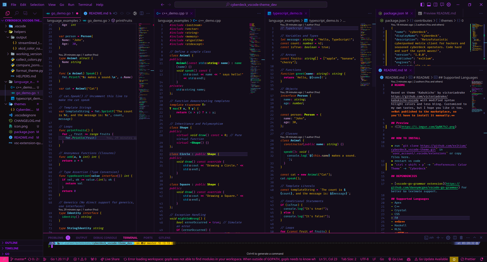

# Cyberdeck theme for VS Code

Based on theme 'Kabukicho' by victoriadrake https://github.com/victoriadrake/kabukicho-vscode with modified syntax hilight colors and less bling. Which is based on several other themes. 
Customized to my own tastes, but I hope you like it too. **Not published to the marketplace, so you'll have to install it manually.**

## Preview
- 

## HOW TO INSTALL

* run `git clone https://github.com/ex1tium/cyberdeck_vscode-theme.git` in `user_account/.vscode/extensions` or copy files here.
* restart vs code
* `ctrl + shift + p` -> `>Preferences: Color Theme` -> `Cyberdeck`

## DEPENDENCIES

- [vscode-go-grammar extension](https://github.com/dannymcgee/vscode-go-grammar) For better Go textmate support.

## Supported Languages
- Apex
- C++
- Crystal
- CSS
- F#
- **Go**
- Haskell
- HLSL
- **HTML**
- **JavaScript**
- Julia
- Lua
- **Markdown**
- Nim
- OCaml
- PowerShell
- Python
- Ruby
- Rust
- Scala
- Swift
- Terraform
- **TypeScript**
- Vala

## Tested languages
- As this theme is originally based on 'Kabukicho' by victoriadrake, it supports all languages that are supported by that theme. I have tested and further developed it with C#, HTML, CSS, JavaScript, TypeScript, Markdown and Go, 

## Notes

There is `./helpers/` folder with some python scripts to help with theme development. They are not necessary for the theme to work, but they are useful for me. You can ignore them.
